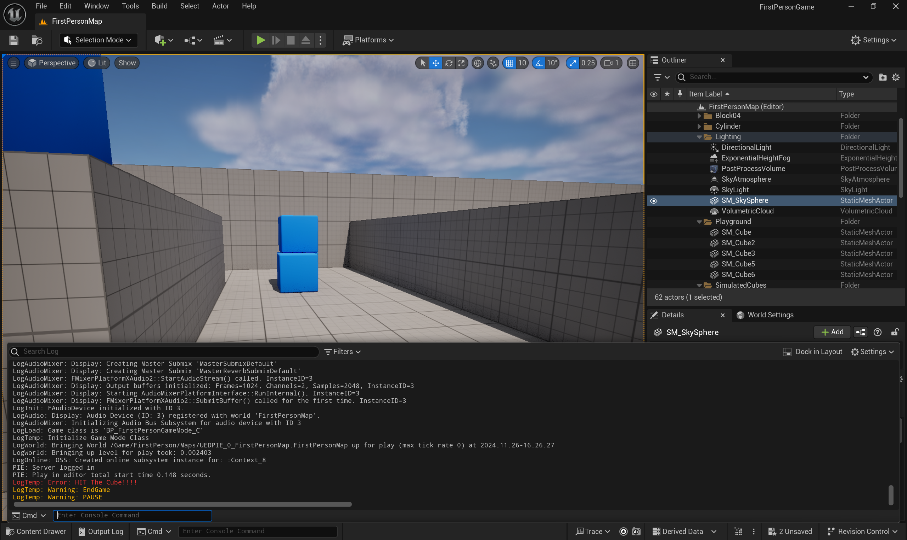
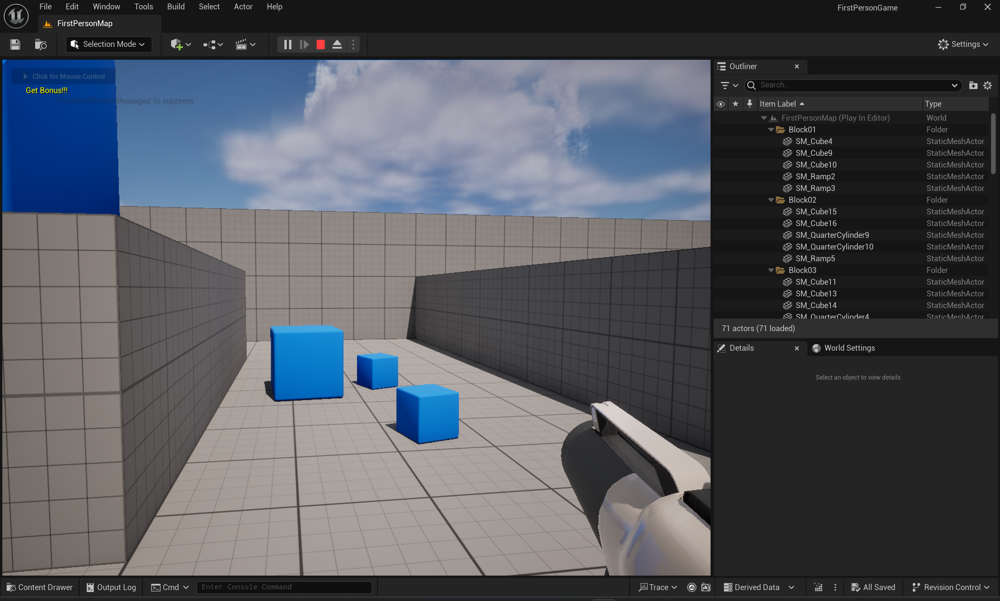

## 作业二

> 1. 物件规则：
>    1. 射击命中方块后，积分`x`分
>    2. 方块被子弹命中后，缩放`y`倍，再次命中被销毁
>    3. 上述所有参数可配置
> 2. 游戏流程
>    1. 游戏开始时随机`N`个方块成为"重要目标"，射击命中后获得双倍积分
>    2. 游戏开始后限时`T`秒，时间到后游戏结算，打印日志输出每个玩家获得的积分和所有玩家获得的总积分
>    3. 上述参数可配置
> 3. 附加题
>    1. 利用UMG制作结算UI代替日志打印
>    2. 支持多人联机（修复FPP模板缺陷）

### 数据存储设计

- 在UE5中GameMode和GameState都用了单例模式，即只有一个实例，用于存储一些全局的信息
- 我个人的理解来看（可能不太准确），GameMode用于存储静态的游戏信息（比如配置信息，游戏对象，控制器）；而GameState用于存储动态的游戏信息
- GameMode指定游戏的规则，比如终止的条件；GameMode通过GameState来获取当前的游戏状态信息
- 从网络同步角度来看，GameMode仅存在服务器上，因此如果要在客户端进行同步的信息，最好存在GameState上
- 因此对于此作业而言，配置信息`x`、`y`、`N`、`T`存储在GameMode上；当前的得分、游戏对局剩余时间存储在GameState上
- GameState的类配置在GameMode中进行，可以在构造函数进行配置，也可以在蓝图中进行配置

### 计时效果实现

- 根据GameMode中配置的游戏对局时长，每个Tick对该变量减去DeltaTime，如果此变量小于等于0就说明对局结束，调用`SetPause`函数来使游戏暂停

- Tick函数如下

  ```c++
  void AFirstPersonGameGameMode::Tick(float DeltaTime)
  {
  	Super::Tick(DeltaTime);
  	RemainingTime -= DeltaTime;
  	if (RemainingTime <= 0 && !isEnd)
  	{
  		isEnd = true;
  		EndGame();
  	}
  	//UE_LOG(LogTemp, Warning, TEXT("Remaining Time: %f"), RemainingTime);
  }
  ```

- `EndGame`函数如下

  ```c++
  void AFirstPersonGameGameMode::EndGame()
  {
  	UE_LOG(LogTemp, Warning, TEXT("EndGame"));
  	APlayerController* PlayerController = UGameplayStatics::GetPlayerController(GetWorld(), 0);
  	if (PlayerController)
  	{
  		UE_LOG(LogTemp, Warning, TEXT("PAUSE"));
  		isEnd = true;
  		SetPause(PlayerController);
  	}
  }
  ```

### 子弹碰撞方块检测实现

- 创建继承于`AActor`的类`ATargetCube`用于实现方块的逻辑，基于此类创建蓝图，并添加网格和材质

- 在`Projectile`类的`OnHit`函数中进行实现，检查撞击到的Actor是否为`TargeCube`类型

- 通过`Cast`函数将`AActor`转化为`ATargetCube`，检查转换后的指针是否为空，若非空，说明撞击到了目标方块

  ```c++
  if ((OtherActor != nullptr) && (OtherActor != this) && (OtherComp != nullptr) && OtherComp->IsSimulatingPhysics())
  {
  	OtherComp->AddImpulseAtLocation(GetVelocity() * 100.0f, GetActorLocation());
  	ATargetCube* targetCube = Cast<ATargetCube>(OtherActor);
  	if (targetCube)
  	{
  		UE_LOG(LogTemp, Error, TEXT("HIT The Cube!!!!"));
  	}
  	Destroy();
  }
  ```

- 测试结果如下

  

- 通过进一步添加记分逻辑即可实现得分统计，完整代码如下

  ```c++
  void AFirstPersonGameProjectile::OnHit(UPrimitiveComponent* HitComp, AActor* OtherActor, UPrimitiveComponent* OtherComp, FVector NormalImpulse, const FHitResult& Hit)
  {
  	// Only add impulse and destroy projectile if we hit a physics
  	if ((OtherActor != nullptr) && (OtherActor != this) && (OtherComp != nullptr) && OtherComp->IsSimulatingPhysics())
  	{
  		OtherComp->AddImpulseAtLocation(GetVelocity() * 100.0f, GetActorLocation());
  		ATargetCube* targetCube = Cast<ATargetCube>(OtherActor);
  		if (targetCube)
  		{
  			auto currentGameState = GetWorld()->GetGameState<AFirstGameStateBase>();
  			if (currentGameState)
  			{
  				int32 currentScore = currentGameState->GetTotalScore();
  				currentGameState->SetTotalScore(currentScore + targetCube->Points);
  			}
  			targetCube->OnHit();
  		}
  		Destroy();
  	}
  }
  ```


### 随机初始化特殊方块实现

- 通过查找场景中`ATarget`类的对象，来获取所有的TargetCube对象

- 调用TargetCube暴露的设置特殊性的接口来随机设置方块的特殊性

  ```c++
  void AFirstPersonGameGameMode::InitializeItems()
  {
  	TArray<AActor*> FoundActors;
  	UGameplayStatics::GetAllActorsOfClass(GetWorld(), ATargetCube::StaticClass(), FoundActors);
  	if (FoundActors.Num() == 0)
  	{
  		UE_LOG(LogTemp, Error, TEXT("No TargetCube Found in Scene"));
  		return;
  	}
  	Algo::RandomShuffle(FoundActors);
  	uint32 NumToSelect = FMath::Min(FoundActors.Num(), ImportantTargetCount);
  	for (uint32 index = 0; index < NumToSelect; ++index)
  	{
  		ATargetCube* targetCube = Cast<ATargetCube>(FoundActors[index]);
  		if (targetCube)
  		{
  			targetCube->SetIsImportantTarget(true);
  			UE_LOG(LogTemp, Log, TEXT("Marked TargetCube %s as important."), *targetCube->GetName());
  		}
  		else
  		{
  			UE_LOG(LogTemp, Warning, TEXT("Failed to cast actor to ATargetCube."));
  		}
  	}
  }
  ```

- 击中特殊方块后，在屏幕上给出反馈，并在记分时乘上倍率

  ```c++
  void AFirstPersonGameProjectile::OnHit(UPrimitiveComponent* HitComp, AActor* OtherActor, UPrimitiveComponent* OtherComp, FVector NormalImpulse, const FHitResult& Hit)
  {
  	// Only add impulse and destroy projectile if we hit a physics
  	if ((OtherActor != nullptr) && (OtherActor != this) && (OtherComp != nullptr) && OtherComp->IsSimulatingPhysics())
  	{
  		OtherComp->AddImpulseAtLocation(GetVelocity() * 100.0f, GetActorLocation());
  		ATargetCube* targetCube = Cast<ATargetCube>(OtherActor);
  		if (targetCube)
  		{
  			auto currentGameState = GetWorld()->GetGameState<AFirstGameStateBase>();
  			auto myGameMode = Cast<AFirstPersonGameGameMode>(UGameplayStatics::GetGameMode(GetWorld()));
  			if (myGameMode && currentGameState)
  			{
  				int32 currentScore = currentGameState->GetTotalScore();
  				if (targetCube->GetIsImportantTarget())
  				{
  					GEngine->AddOnScreenDebugMessage(
  						-1,
  						10.0f,
  						FColor::Yellow,
  						TEXT("Get Bonus!!!")
  					);
  					currentGameState->SetTotalScore(currentScore + myGameMode->GetPointsPerHit() * myGameMode->GetBonusMagnification());
  				}
  				else
  				{
  					currentGameState->SetTotalScore(currentScore + myGameMode->GetPointsPerHit());
  				}
  				targetCube->OnHit(myGameMode->GetScaleFactor());
  			}
  		}
  		Destroy();
  	}
  }
  ```

- 效果如下

  
