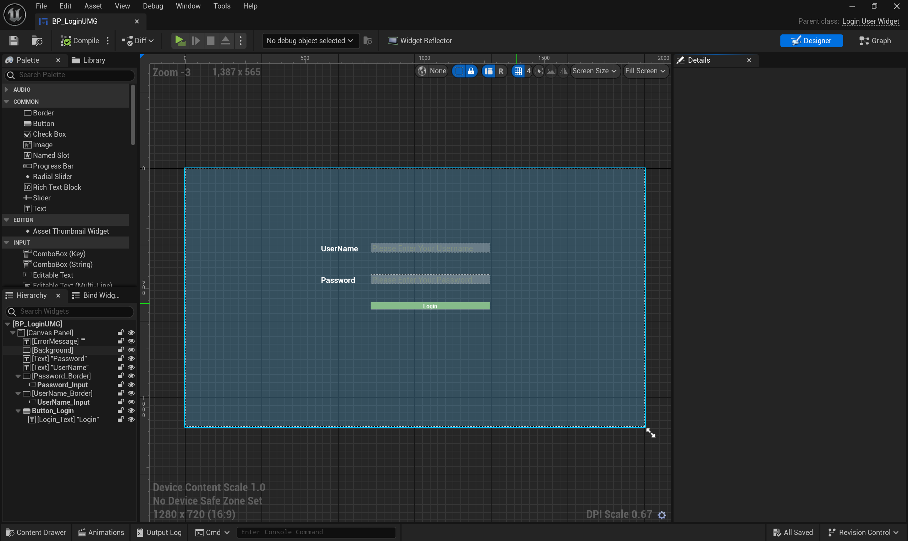
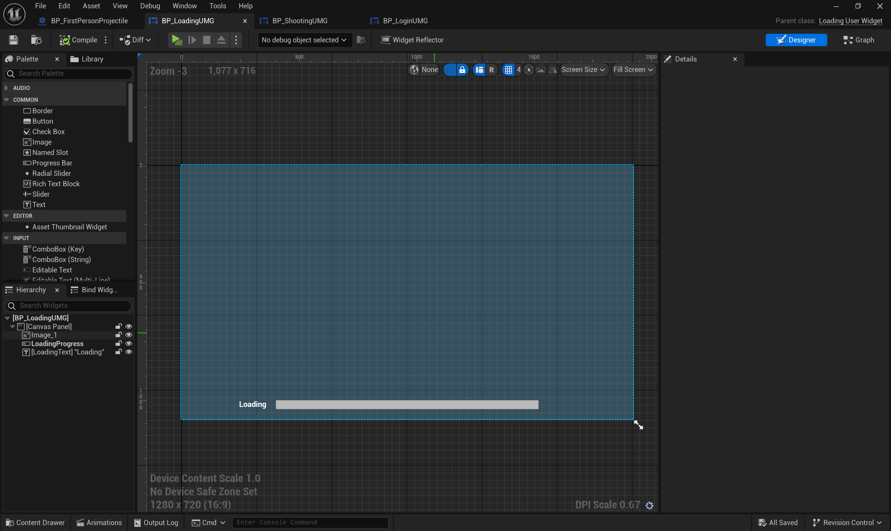
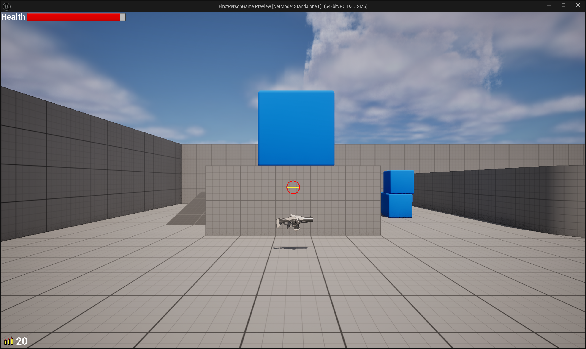

# Assignment3

> 1. 实现登录界面（输入用户名和密码，其中密码加密显示，有确认按钮）
> 2. 实现加载界面（要有动画表传达正在加载）
> 3. 实现射击游戏的操作面板（要有血条，子弹数量，击中玩家会发生变化的准星）

## 登录界面

首先创建UMG蓝图，在designer中设计图形界面，如下图



UI交互的逻辑通过c++代码实现，首先需要将UMG蓝图中的组件与C++代码绑定，创建继承自`UserWidget`的类，并将需要用到的UI组件进行绑定，通过`UPROPERTY(meta=(BindWidget))`实现c++代码向UMG UI组件的绑定，需要注意的是其命名需要与UMG中的命名一致，对于需要使用到的UI组件类型，可以使用类声明来声明，具体代码如下

```c++
// Fill out your copyright notice in the Description page of Project Settings.

#pragma once

#include "CoreMinimal.h"
#include "Blueprint/UserWidget.h"
#include "LoginUserWidget.generated.h"
class UButton;
class UTextBlock;
class UEditableText;
/**
 * 
 */
UCLASS()
class FIRSTPERSONGAME_API ULoginUserWidget : public UUserWidget
{
	GENERATED_BODY()
public:
	virtual void NativeConstruct() override;
protected:

	UFUNCTION()
	void OnLoginButtonClicked();

	UFUNCTION()
	bool ValidateUserInput();

	UPROPERTY(BlueprintReadOnly, meta=(BindWidget))
	UButton* Button_Login;
	
	UPROPERTY(BlueprintReadOnly, meta=(BindWidget))
	UTextBlock* ErrorMessage;  //  提示信息

	UPROPERTY(BlueprintReadOnly, meta=(BindWidget))
	UEditableText* Password_Input;  //  密码输入文本框

	UPROPERTY(BlueprintReadOnly, meta=(BindWidget))
	UEditableText* UserName_Input;  //  用户名文本输入框
};

```

首先在构造函数`NativeConstruct`中对按钮绑定点击事件，通过`OnClicked.AddDynamic`来添加点击事件处理函数

```c++
Button_Login->OnClicked.AddDynamic(this, &ULoginUserWidget::OnLoginButtonClicked);
```

在点击事件处理函数中，通过`ValidateUserInput`函数来检查用户的输入信息是否合法，如果不合法会显示提示信息，若合法则跳转到加载界面，通过如下方式首先界面的跳转

```c++
UGameplayStatics::OpenLevel(GetWorld(), TEXT("LoadingMap"));
```

## 加载界面

同样先创建UMG蓝图，然后设计相应的UI界面



进度条加载通过UMG动画来实现，然后在c++中进行动画组件的绑定，类似于UI组件的绑定，通过`UPROPERTY(meta=(BindWidgetAnim), Transient)`宏进行动画组件的绑定，如下

```c++
UPROPERTY(meta=(BindWidgetAnim), Transient)
UWidgetAnimation* LoadingAnimation;
```

> Transient：表示资源在序列化时会被忽略，而不会保存在磁盘，只有在运行时存在

为了实现在加载完成后跳转到游戏的主界面，通过给动画绑定回调函数来实现此功能，具体实现代码如下

```c++
FWidgetAnimationDynamicEvent AnimationEvent;
AnimationEvent.BindDynamic(this, &ULoadingUserWidget::OnLoadingAnimationFinished);
this->BindToAnimationFinished(LoadingAnimation, AnimationEvent);  //  绑定动画播放完后要调用的回调函数
PlayAnimation(LoadingAnimation);
```

回调函数即打开另一个Level，如下

```c++
void ULoadingUserWidget::OnLoadingAnimationFinished()
{
	GetWorld()->GetTimerManager().ClearTimer(UpdateTextTimer);
	UGameplayStatics::OpenLevel(GetWorld(), TEXT("FirstPersonMap"));
}
```

## 射击UI

### 血条UI

血条和之前实现的倒计时逻辑关联，随着倒计时的开始，血条不断降低，为0时游戏结束，通过对外实现一个可以操纵血条UI组件的接口，然后供外部调用即可

```c++
void UShootingUserWidget::ReceiveDamage(float percent)
{
	HealthProgress -= percent;
	HealthProgress = FMath::Clamp(HealthProgress, 0.0f, 1.0f);
	Health_Bar->SetPercent(HealthProgress);
}
```

由于倒计时的逻辑是在GameMode类中实现的，而该接口是在UserWidget类中实现的，那么该如何在GameMode类中获得UserWidget的引用呢，具体实现方法如下

首先UserWidget是通过HUD类创建的，而HUD类会对应一个PlayerController，通过`GetOwningPlayerController`来获得其对应的PlayerController，然后在HUD中创建UserWidget后，将对该UserWidget的引用(指针)赋值给PlayerController的成员变量，HUD类的代码如下

```c++
void AShootingHUD::BeginPlay()  //  通过c++实现HUD的创建UserWidget逻辑，并将对UserWidget的引用传递给角色控制器
{
	Super::BeginPlay();
	if (ShootingUserWidgetClass)
	{
		UE_LOG(LogTemp, Warning, TEXT("Widget Setting Validate!!!"));
		UUserWidget* Widget = CreateWidget<UUserWidget>(GetOwningPlayerController(), ShootingUserWidgetClass);
		if (Widget)
		{
			Widget->AddToViewport();
			AFirstPersonGamePlayerController* MyController = Cast<AFirstPersonGamePlayerController>(GetOwningPlayerController());
			if (MyController)
			{
				MyController->ShootingUserWidget = Cast<UShootingUserWidget>(Widget);
			}
		}
	}
}
```

接着，只需要在GameMode中通过`GetWorld()->GetFirstPlayerController()`来获得PlayerController即可，接着就可以在PlayerController中调用对应UserWidget的方法来实现两者的交互

```c++
MyController = Cast<AFirstPersonGamePlayerController>(GetWorld()->GetFirstPlayerController());
MyController->ShootingUserWidget->ReceiveDamage(DeltaTime / GameDuration);
```

### 准星UI

准星UI主要是要实现在击中物体后的变化效果，本质上就是在击中物体后播放准星的UMG动画，同样面临这样的问题，击中物体的逻辑是在AActor类中实现的，那么我们只需要获取到PlayerController就可以通过PlayerController来获取到UserWidget对象的引用，从而调用播放动画的接口，通过如下方式获取

```c++
MyPlayerController = Cast<AFirstPersonGamePlayerController>(UGameplayStatics::GetPlayerController(GetWorld(), 0));
```

然后在击中物体后，调用播放击中反馈动画的接口即可

```c++
MyPlayerController->ShootingUserWidget->PlayHitFeedback();  //  通过Controller调用UMG动画
```

### 子弹数量UI

显示子弹的数量，并在射击后更新UI中显示的数量，实现思路同上，实现一个公共的接口，然后在进行射击逻辑的类中通过PlayerController来调用此方法即可

最终的效果如下

