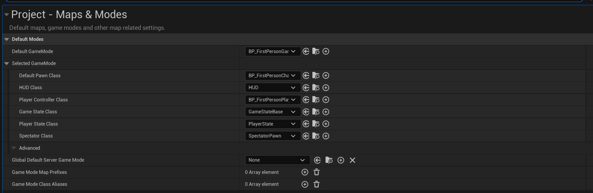

# TroubleShoot

## Android打包问题

### 需要安装Android Studio

- 最主要的是要安装`Android SDK Command-line Tool`
- 然后执行虚幻引擎安装位置`Engine\Extras\Android\SetupAndroid.bat`
- 上述脚本会安装打包需要的jdk以及ndk

### Gradle下载问题

- 在打包的最终阶段，会遇到要安装gradle，但是下载失败的问题
- 解决方法是自行下载压缩包，然后将压缩包放置在`C:/User/Username/.gradle/wrapper/dist/gradle版本/乱码/`

### Java版本问题

```
Could not open settings generic class cache for settings file 'Z:\settings.gradle' (C:\Users\OriginOvO\.gradle\caches\7.5\scripts\356clt8w0kvd14538qat92yfl).
```

- 网上找到了相关的报错[**Could not open settings generic class cache for settings file ‘Z:\settings.gradle’**](https://forums.unrealengine.com/t/could-not-open-settings-generic-class-cache-for-settings-file-z-settings-gradle/1603860)
- 解决方法是下载java18
- gradle和jdk的版本对应[gradle和jdk版本对应关系](https://www.cnblogs.com/zhangzaizz/p/18120393)

### 代理配置问题

```
UATHelper: Packaging (Android (ASTC)): A problem occurred configuring root project 'app'.
UATHelper: Packaging (Android (ASTC)): > Could not resolve all files for configuration ':classpath'.
UATHelper: Packaging (Android (ASTC)):    > Could not resolve com.android.tools.build:gradle:7.4.2.
UATHelper: Packaging (Android (ASTC)):      Required by:
UATHelper: Packaging (Android (ASTC)):          project :
UATHelper: Packaging (Android (ASTC)):       > Could not resolve com.android.tools.build:gradle:7.4.2.
UATHelper: Packaging (Android (ASTC)):          > Could not get resource 'https://dl.google.com/dl/android/maven2/com/android/tools/build/gradle/7.4.2/gradle-7.4.2.pom'.
UATHelper: Packaging (Android (ASTC)):             > Could not GET 'https://dl.google.com/dl/android/maven2/com/android/tools/build/gradle/7.4.2/gradle-7.4.2.pom'.
UATHelper: Packaging (Android (ASTC)):                > Connect to 127.0.0.1:7890 [/127.0.0.1] failed: Connection refused: no further information
UATHelper: Packaging (Android (ASTC)):       > Could not resolve com.android.tools.build:gradle:7.4.2.
UATHelper: Packaging (Android (ASTC)):          > Could not get resource 'https://repo.maven.apache.org/maven2/com/android/tools/build/gradle/7.4.2/gradle-7.4.2.pom'.
UATHelper: Packaging (Android (ASTC)):             > Could not GET 'https://repo.maven.apache.org/maven2/com/android/tools/build/gradle/7.4.2/gradle-7.4.2.pom'.
UATHelper: Packaging (Android (ASTC)):                > Connect to 127.0.0.1:7890 [/127.0.0.1] failed: Connection refused: no further information
```

- 从上述日志信息中可以看出，程序试图通过`127.0.0.1:7890`代理来下载对应文件
- 发现这是由于默认的代理配置错误导致的，在`C:/User/Username/.gradle/gradle.properties`中将代理配置成本机的代理所在的端口即可

### No Google Play Store Key

- 打包完成，在手机端运行程序时，出现上述报错
- 在`Project Settings > Platforms > Android > Package game data inside .apk`，将此选项勾选
- 然后将`Intermediate/Android/`中除了`arm64`的其他文件删除，然后重启UE
- 重新打包项目

- 打包完成后，会发现安装包比之前的大了一倍


## UE5 C++项目构建配置

[参考官方文档](https://dev.epicgames.com/documentation/zh-cn/unreal-engine/compiling-game-projects-in-unreal-engine-using-cplusplus)

**Development (开发模式)**

- **用途**：这是最常用的模式，用于日常开发和调试。
- **特点**：优化程度适中，带有调试符号，运行速度快于 Debug，但比 Shipping 慢。
- **适合**：日常开发、调试 C++ 代码、运行编辑器模式。

**Debug (调试模式)**

- **用途**：用于深度调试代码或解决复杂问题。
- **特点**：未优化，包含完整的调试符号，运行速度较慢，但方便调试。
- **适合**：需要调试低级错误或特定模块时。

**Shipping (发行模式)**

- **用途**：用于发布最终产品（游戏、应用）。
- **特点**：完全优化，移除所有调试符号，目标是提供最佳性能。
- **适合**：最终的产品构建。

## C++与蓝图如何关联起来

### 1. 在C++中创建蓝图中可以调用的函数

使用`UFUNCTION(BlueprintCallable)`宏标记C++函数，使其可以在蓝图中被调用

```c++
UFUNCTION(BlueprintCallable, Category="MyCategory")
void MyFunction();
```

### 2. 在C++中创建蓝图事件

用`UFUNCTION(BlueprintImplementableEvent)`使其可以在蓝图中实现

```c++
UFUNCTION(BlueprintImplementableEvent, Category="MyCategory")
void MyBlueprintEvent();
  
```

### 3. 在C++中创建蓝图可重写事件

使用`UFUNCTION(BlueprintNativeEvent)`宏标记 C++ 函数，使其可以在蓝图中重写，同时提供一个 C++ 默认实现。

```c++
UFUNCTION(BlueprintNativeEvent, Category="MyCategory")
void MyNativeEvent();
void MyNativeEvent_Implementation();
```

### 4. 在C++中创建蓝图可编辑的变量

使用`UPROPERTY(EditAnywhere, BlueprintReadWrite)`宏标记 C++ 变量，使其可以在蓝图中编辑和读取。注意这样的成员变量的访问权限只能为`public`

```c++
UPROPERTY(EditAnywhere, BlueprintReadWrite, Category="MyCategory")
int32 MyVariable;
```

### 5. 在蓝图中使用C++类

创建基于C++类的蓝图

## GameState类实例化问题

- GameState类的实例化由GameMode来进行管理

- 在C++中通过在构造函数中设置GameState类来绑定对应GameState类的实例化

  ```c++
  AFirstPersonGameGameMode::AFirstPersonGameGameMode()
  	: Super()
  {
  	GameStateClass = AFirstGameStateBase::StaticClass();
  }
  ```

- 或者在蓝图中进行设置

  